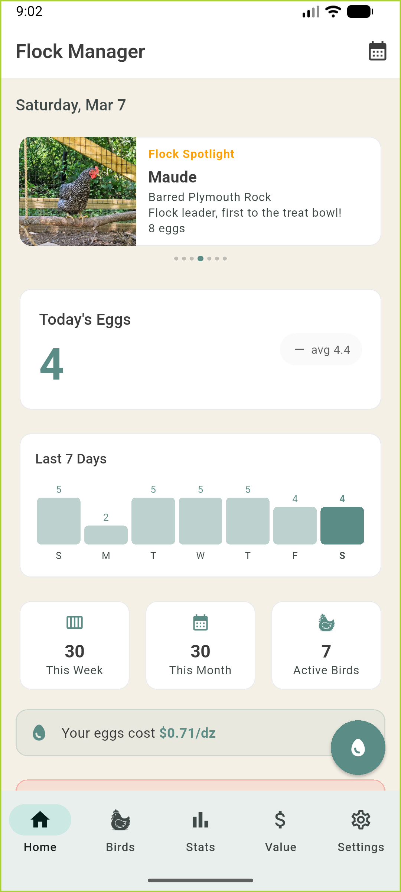
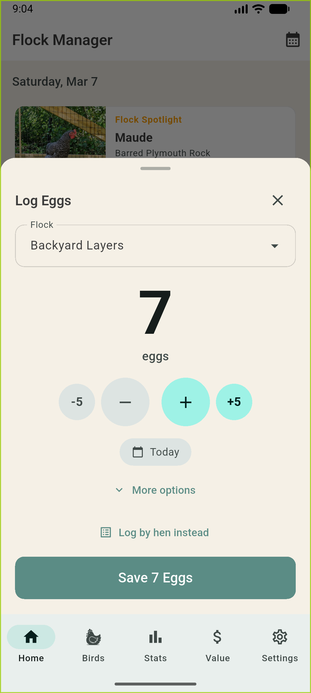
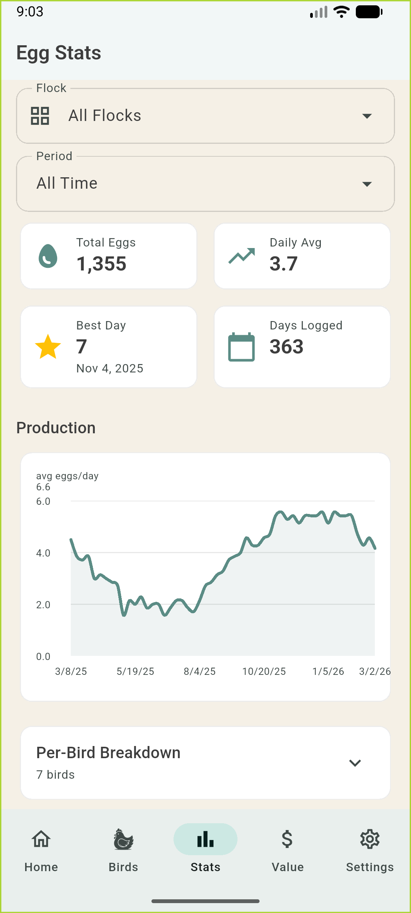
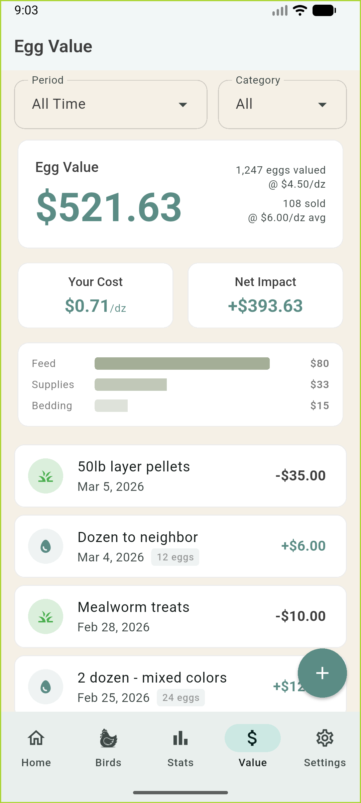
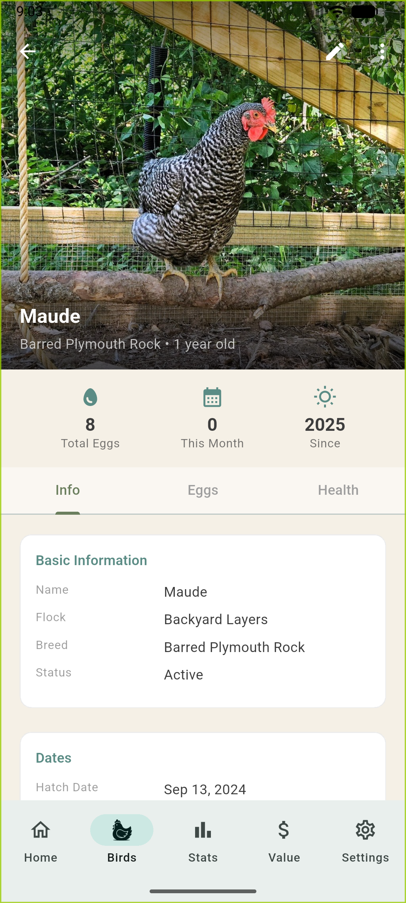
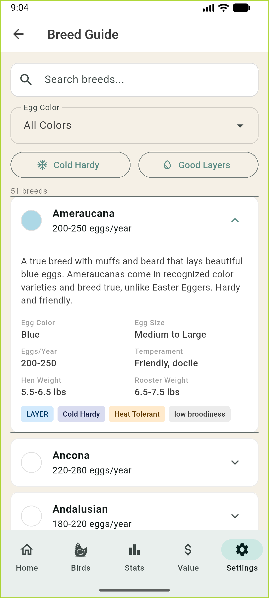

# Flock Manager

A cross-platform mobile app for backyard chicken keepers to track flocks, log eggs, monitor expenses, and manage bird health.

[](https://play.google.com/store/apps/details?id=com.tyndallstudios.flockmanager&hl=en_US)
[](https://apps.apple.com/us/app/flock-manager/id6758640804)

Built for my own backyard flock in Asheville, NC.

**Current Version:** 2.3.1

## Screenshots

<p align="center">
  
  
  
</p>
<p align="center">
  
  
  
</p>

## Tech Stack

- **Framework:** Flutter 3.x
- **Language:** Dart
- **Database:** SQLite via `sqflite`
- **State Management:** Riverpod (riverpod + flutter_riverpod)
- **Navigation:** GoRouter
- **Charts:** fl_chart
- **Photos:** image_picker
- **Preferences:** shared_preferences
- **Notifications:** awesome_notifications + timezone
- **Export/Import:** archive, share_plus, file_picker
- **In-App Purchases:** in_app_purchase
- **Models:** freezed

## Getting Started

### Prerequisites

- Flutter SDK 3.10.4+
- Dart SDK 3.10.4+
- Xcode (for iOS)
- Android Studio (for Android)

### Installation

```bash
# Clone the repository
git clone <repository-url>
cd flock_manager

# Install dependencies
flutter pub get

# Generate freezed classes
dart run build_runner build

# Run the app
flutter run
```

## Commands

```bash
# Run app
flutter run

# Run on specific device
flutter run -d <device_id>

# Build release
flutter build apk
flutter build ios

# Run tests
flutter test

# Generate freezed classes
dart run build_runner build

# Clean rebuild
flutter clean && flutter pub get

# Static analysis
flutter analyze
```

## Architecture

```
lib/
├── main.dart                 # App entry, providers, router setup
├── app/
│   ├── router.dart           # GoRouter configuration
│   └── theme.dart            # ThemeData, colors, text styles
├── data/                     # Static reference data
│   ├── breeds.dart           # 50+ chicken breeds
│   ├── medications.dart      # Medication reference guide
│   └── test_data.dart        # Sample data for development/screenshots
├── models/                   # Freezed data classes
├── database/
│   ├── database_helper.dart  # SQLite singleton, migrations
│   └── tables.dart           # Table creation SQL
├── repositories/             # Data access layer
├── providers/                # Riverpod providers
├── screens/                  # Full-page views
├── widgets/                  # Reusable components
├── services/                 # Notification service, etc.
└── utils/                    # Helpers (distribution, grouping, constants)
```

## Database Schema

### Tables

| Table | Purpose |
|-------|---------|
| `flocks` | Flock groups (e.g., "Backyard Hens") |
| `birds` | Individual birds with breed, age, status |
| `bird_photos` | Multiple photos per bird |
| `bird_status_events` | History of status changes per bird |
| `egg_logs` | Daily egg production records |
| `expenses` | Cost tracking by category |
| `income` | Egg sales and other income |
| `medication_logs` | Medications with withdrawal tracking |
| `health_notes` | Health observations per bird |

### Enums

```dart
enum BirdStatus { active, deceased, sold, givenAway }
enum BirdSex { male, female }
enum BirdSpecies { chicken, duck, turkey, guinea, quail, other }
enum EggSize { small, medium, large, jumbo }
enum EggQuality { normal, softShell, doubleYolk, abnormal, fairy }
enum ExpenseCategory { feed, bedding, supplies, medical, equipment, other }
enum CategoryType { regular, irregular }
enum HealthNoteType { observation, symptom, treatment, vetVisit, other }
enum RecurringInterval { weekly, monthly }
enum ForecastTier { ... }
```

## Testing

```bash
# Run all tests
flutter test

# Run with coverage
flutter test --coverage
```

Test structure:
- `test/models/` - Model unit tests (toMap, fromMap, computed properties)
- `test/database/` - Database schema tests
- `test/repositories/` - Repository CRUD tests (flock, bird, egg)
- `test/providers/` - Provider and analytics class tests
- `test/services/` - Service layer tests
- `test/utils/` - Utility function tests (distribution helper, egg log grouper)
- `test/widgets/` - Widget tests
- `test/helpers/` - Test utilities and mocks

## Key Features

- **Quick Egg Logging** - Log daily eggs in 2 taps from anywhere in the app
- **Egg Distribution** - Evenly distribute eggs to individual birds for small flocks (2-10 birds)
- **Daily Reminders** - Configurable notifications to remind you to log eggs
- **Flock Management** - Organize birds into multiple flocks
- **Bird Profiles** - Track individual birds with photos, breed, hatch date, sex, and status
- **Egg Value Analytics** - Compare your flock's egg production value against store prices with cost per dozen, net impact, and savings calculations
- **Financial Forecasting** - Project costs and egg value forward based on historical trends
- **Tappable Summary Cards** - Tap financial cards for step-by-step math breakdowns
- **Expense & Income Tracking** - Monitor costs by category and log egg sales with flock filtering
- **Medication Tracking** - Log treatments with egg withdrawal period alerts
- **Health Notes** - Record observations, symptoms, and vet visits per bird
- **Achievements** - 50+ badges across production, financial, health, and engagement categories
- **Analytics** - View production trends, per-bird statistics, and cost analysis
- **Data Export/Import** - Backup and restore your data with photo support
- **Breed Reference** - Built-in guide to 50+ chicken breeds with egg color, temperament, and production info
- **Medication Reference** - Common treatments with dosages and withdrawal periods
- **Theme Customization** - Three color palettes (Barn Red, Sage, Egg-Inspired)

## License

All rights reserved. You're welcome to read the code, but
no rights to use, copy, modify, or redistribute it are granted.
See [LICENSE](LICENSE) for details.
